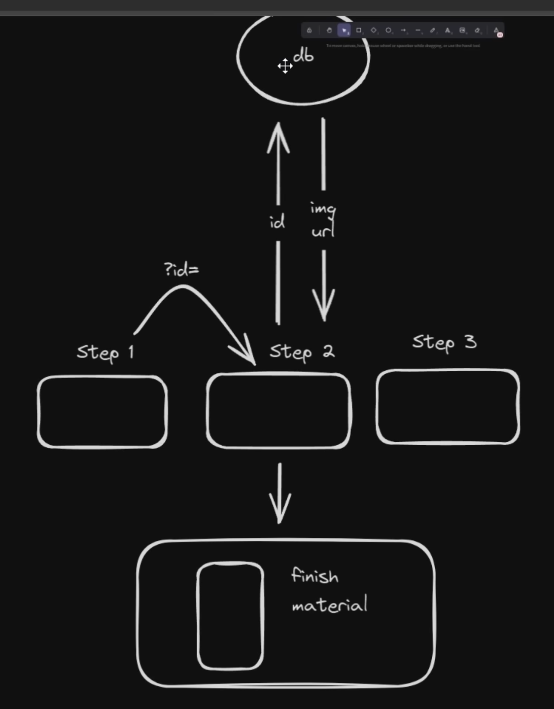
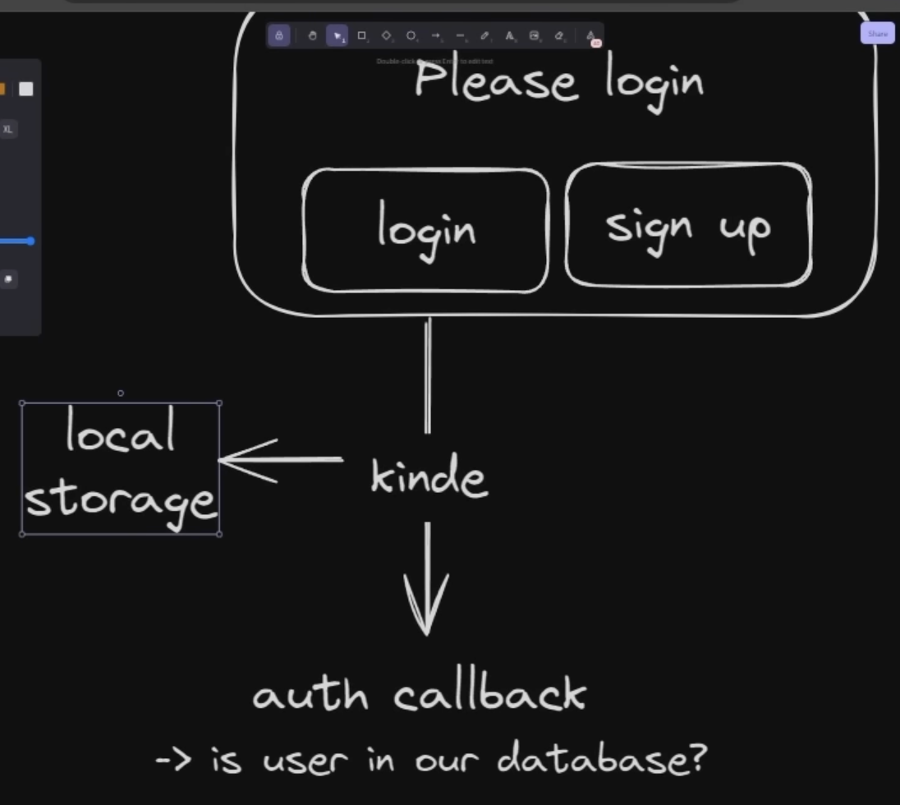
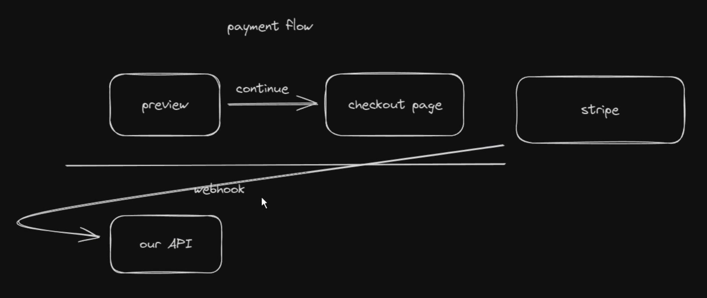

# About Project

> ...?!

## Nguồn học

- 📚 [Build a Complete E-Commerce Shop with Next.js 14, Tailwind, React | Full Course 2024](https://www.youtube.com/watch?v=SG82Aqcaaa0)
  - Highlights:
    - 🛠️ Complete shop built from scratch in Next.js 14
    - 💻 Beautiful landing page included
    - 🎨 Custom artworks made by a professional illustrator
    - 💳 Secret admin dashboard to manage orders
    - 🖥️ Drag-and-drop file uploads
    - 🛍️ Customers can purchase directly from you
    - 🌟 Clean, modern UI on top of shadcn-ui
    - 🛒 Completely custom phone case configurator
    - 🔑 Authentication using Kinde
    - ✉️ Beautiful thank-you email after purchase
    - ✅ Apple-inspired configurator design
    - ⌨️ 100% written in TypeScript
- 🔗 [joschan21/casecobra](https://github.com/joschan21/casecobra/tree/master)

## Sử dụng Package Manager `pnpm`

- Lệnh khởi tạo dự án với [Next.js](https://nextjs.org/docs/app/api-reference/cli/create-next-app) - `pnpm dlx create-next-app@latest`.

- Lệnh chạy dự án - `pnpm run dev`.

- Lệnh build dự án - `pnpm run build`.

## Các Package sử dụng

### 1. [shadcn/ui](https://ui.shadcn.com/)

- Lệnh cài đặt gói - `pnpm dlx shadcn@latest init`.
  - Đây là một thư viện Component UI cho `React` & `Next.js`, được xây dựng trên Radix UI và sử dụng `Tailwind CSS`.

- Tính năng chính:
  - 📌 Component UI đơn giản, dễ tùy chỉnh, không có style cứng nhắc.
  - 📌 Dùng Tailwind CSS & Radix UI, giúp dễ dàng mở rộng & tùy chỉnh.
  - 📌 Không phải một package npm cồng kềnh → Bạn cài component trực tiếp vào code.
  - 📌 Tối ưu hiệu suất, không tải dư thừa dependency.
  - 📌 Hoạt động tốt với Next.js & React Server Components (RSC).

- Lệnh cài đặt các `Component`:
  - Lệnh cài đặt thêm gói [Component Button](https://ui.shadcn.com/docs/components/button) - `pnpm dlx shadcn@latest add button`.
  - Lệnh cài đặt thêm gói [Component Progress](https://ui.shadcn.com/docs/components/progress) - `pnpm dlx shadcn@latest add progress`.
  - Lệnh cài đặt thêm gói [Component Sonner](https://ui.shadcn.com/docs/components/sonner) - `pnpm dlx shadcn@latest add sonner`.
  - Lệnh cài đặt thêm gói [Component Aspect Ratio](https://ui.shadcn.com/docs/components/aspect-ratio) - `pnpm dlx shadcn@latest add aspect-ratio`.
  - Lệnh cài đặt thêm gói [Component Scroll Area](https://ui.shadcn.com/docs/components/scroll-area) - `pnpm dlx shadcn@latest add scroll-area`.
  - Lệnh cài đặt thêm gói [Component Label](https://ui.shadcn.com/docs/components/label) - `pnpm dlx shadcn@latest add label`.
  - Lệnh cài đặt thêm gói [Component Dropdown Menu](https://ui.shadcn.com/docs/components/dropdown-menu) - `pnpm dlx shadcn@latest add dropdown-menu`.
  - Lệnh cài đặt thêm gói [Component Dialog](https://ui.shadcn.com/docs/components/dialog) - `pnpm dlx shadcn@latest add dialog`.
  - Lệnh cài đặt thêm gói [Component Card](https://ui.shadcn.com/docs/components/card) - `pnpm dlx shadcn@latest add card`.
  - Lệnh cài đặt thêm gói [Component Table](https://ui.shadcn.com/docs/components/table) - `pnpm dlx shadcn@latest add table`.

- <u>Các lưu ý</u>:
  - [1] _"The `toast` component is deprecated. Use the `sonner` component instead"_.
  - [2] Cách thêm [Theme](https://ui.shadcn.com/themes) - copy và paste đoạn code vào file `globals.css` vị trí `@layer base`.
  - [3] Riêng với `Tailwind V4` (bản mới nhất), đây là cách thêm [Theme](https://ui.shadcn.com/docs/tailwind-v4) vào dự án.

    ```
    Move :root and .dark out of the @layer base
    Wrap the color values in hsl()
    ```

### 2. [Lucide](https://lucide.dev/)

- Lệnh cài đặt gói - `pnpm install lucide-react`.
  - Đây là một thư viện Icon Component dành cho `React`.
  - Cung cấp hơn 1000+ icon đẹp, nhẹ và tùy chỉnh dễ dàng.

- Tính năng chính:
  - 🚀 Icon SVG hiện đại & dễ dùng trong React.
  - 🚀 Có hơn 1000+ icon miễn phí, không cần tải file SVG.
  - 🚀 Tùy chỉnh kích thước (size), màu sắc (color), độ dày (strokeWidth) dễ dàng.
  - 🚀 Hiệu suất cao, không ảnh hưởng đến tốc độ load trang.
  - 🚀 Hỗ trợ TypeScript & dễ tích hợp với Tailwind CSS.

### 3. [Framer Motion](https://www.npmjs.com/package/framer-motion)

- Lệnh cài đặt gói - `pnpm install framer-motion`.
  - Đây là thư viện Animation dành cho `React`.
  - Giúp tạo hiệu ứng động mượt mà và dễ sử dụng.

- Một số khả năng:
  - ✅ Dễ dàng tạo animation chỉ với vài dòng code.
  - ✅ Hỗ trợ animation trên cả client & server.
  - ✅ Tạo hiệu ứng kéo thả (drag & drop).
  - ✅ Tích hợp dễ dàng với Next.js và Tailwind CSS.
  - ✅ Hỗ trợ layout animations, shared transitions, hover effects, v.v.

### 4. [React Dropzone](https://www.npmjs.com/package/react-dropzone)

- Lệnh cài đặt gói - `pnpm install react-dropzone`.
  - Đây là một thư viện `React`.
  - Giúp tạo khu vực kéo & thả (Drag and Drop) để tải lên tệp tin (File Upload) một cách dễ dàng.

- Chức năng chính:
  - 🔥 Hỗ trợ kéo & thả file.
  - 🔥 Cho phép chọn file từ máy nếu không kéo thả.
  - 🔥 Giới hạn loại file, kích thước, số lượng file.
  - 🔥 Hỗ trợ multi-file upload.
  - 🔥 Cung cấp các sự kiện callback để xử lý file khi tải lên.

### 5. [Zod](https://www.npmjs.com/package/zod)

- Lệnh cài đặt gói - `pnpm install zod`.
  - Đây là một thư viện `TypeScript-first`.
  - Giúp _"xác thực" (validation)_ và _"phân tích" (parse)_ dữ liệu một cách an toàn, mạnh mẽ.

- Một số khả năng:
  - ✅ Kiểm tra dữ liệu API request (Validation & Parsing).
  - ✅ Xác thực dữ liệu form trước khi gửi lên server.
  - ✅ Tạo schema an toàn cho dữ liệu trong TypeScript.
  - ✅ Tránh lỗi dữ liệu không hợp lệ khi lưu vào database.

### 6. [Sharp](https://www.npmjs.com/package/sharp)

- Lệnh cài đặt gói - `pnpm install sharp`.
  - Đây là thư viện xử lý hình ảnh (image processing) cực kỳ nhanh, được viết bằng `C++`.
  - Giúp bạn chỉnh sửa, nén, thay đổi kích thước ảnh hiệu quả mà không tốn nhiều tài nguyên.

- Chức năng chính:
  - 🔹 Thay đổi kích thước ảnh (resize).
  - 🔹 Chuyển đổi định dạng ảnh (JPEG, PNG, WebP, AVIF, GIF, v.v.).
  - 🔹 Tối ưu hóa ảnh (giảm dung lượng mà không giảm chất lượng).
  - 🔹 Cắt ảnh (crop) hoặc xoay ảnh (rotate).
  - 🔹 Thêm bộ lọc (blur, sharpen, grayscale, v.v.).
  - 🔹 Hỗ trợ xử lý hàng loạt ảnh nhanh chóng.

### 7. [React Rnd](https://www.npmjs.com/package/react-rnd)

- Lệnh cài đặt gói - `pnpm install react-rnd`.
  - Đây là một thư viện `React`.
  - Giúp tạo các Component có thể kéo thả (draggable) và thay đổi kích thước (resizable).

- Tính năng chính:
  - 🔹 Kéo thả và thay đổi kích thước: Cho phép người dùng kéo thả và thay đổi kích thước các thành phần trong giao diện.​
  - 🔹 Tùy chỉnh linh hoạt: Cung cấp các thuộc tính để thiết lập vị trí, kích thước ban đầu, giới hạn kích thước tối thiểu/tối đa, và các sự kiện callback khi kéo thả hoặc thay đổi kích thước.

### 8. [@headlessui/react](https://www.npmjs.com/package/@headlessui/react)

- Lệnh cài đặt gói - `pnpm install @headlessui/react`.
  - Đây là một thư viện giúp bạn xây dựng các component UI như modal, dropdown, accordion, dialog, menu mà không áp đặt style.
  - Nó cung cấp chức năng UI, nhưng bạn có thể tự thiết kế giao diện theo ý muốn.

- Tính năng chính:
  - 🔥 Cung cấp component UI nhưng không có style sẵn, dễ dàng tùy chỉnh với Tailwind CSS.
  - 🔥 Hỗ trợ accessibility (a11y) giúp UI thân thiện với keyboard & screen reader.
  - 🔥 Được tối ưu cho React, giúp dễ dàng xây dựng UI động mà không cần tự code logic.

### 9. [@tanstack/react-query](https://www.npmjs.com/package/@tanstack/react-query)

- Lệnh cài đặt gói - `pnpm install @tanstack/react-query`.
  - Trước đây là `react-query`.
  - Là một thư viện quản lý dữ liệu và caching dành cho `React`.
  - Giúp tối ưu hóa việc fetch API, giảm số lần gọi API không cần thiết và cải thiện trải nghiệm người dùng.

- Tính năng chính:
  - ✅ Quản lý dữ liệu bất đồng bộ (async state management)
  - ✅ Tự động caching & re-fetch khi dữ liệu thay đổi
  - ✅ Hỗ trợ background sync (đồng bộ dữ liệu khi người dùng quay lại trang)
  - ✅ Tối ưu hóa hiệu suất (giảm số lần gọi API, chỉ fetch khi cần thiết)
  - ✅ Dễ dàng xử lý trạng thái (loading, error, success, refetching)
  - ✅ Hỗ trợ pagination, infinite scrolling, polling (fetch liên tục)

### 10. [react-dom-confetti](https://www.npmjs.com/package/react-dom-confetti)

- Lệnh cài đặt gói - `pnpm install react-dom-confetti`.
  - Là một thư viện hiệu ứng pháo giấy (confetti) dành cho `React`.
  - Giúp hiển thị hiệu ứng ăn mừng khi sự kiện xảy ra.

- Khi nào nên dùng:
  - ✅ Dùng khi muốn thêm hiệu ứng ăn mừng sau sự kiện (mua hàng, đăng ký thành công, đạt được mục tiêu...).
  - ✅ Dễ dùng, nhẹ, không ảnh hưởng đến hiệu suất trang web.

### 11. [@react-email/components](https://www.npmjs.com/package/@react-email/components)

- Lệnh cài đặt gói - `pnpm install @react-email/components`.
  - Đây là thư viện component UI để xây dựng email HTML responsive.
  - Bằng cách dùng cú pháp `React` – như viết giao diện web, nhưng để xuất ra HTML email.

- Mục tiêu chính:
  - 🔧 Cho phép bạn dùng JSX/TSX để viết email layout.
  - 🔧 Dễ bảo trì, dễ chia component (giống code web app).
  - 🔧 Kết xuất ra HTML thuần có thể gửi qua bất kỳ dịch vụ email nào (SendGrid, Resend, v.v.).

- <u>Docs</u>:
  - Sử dụng theo hướng dẫn của [React Email Docs](https://react.email/docs/introduction).

## Các Service sử dụng

### 1. [Kinde](https://kinde.com/)

- Đây là một nền tảng quản lý xác thực người dùng (Authentication) và quyền truy cập (Authorization).
- Giúp các ứng dụng xác thực người dùng, quản lý phiên đăng nhập và phân quyền một cách dễ dàng.

- <u>Docs</u>:
  - Sử dụng theo hướng dẫn của [Kinde Docs](https://docs.kinde.com/developer-tools/sdks/backend/nextjs-sdk/).

- <u>Step 1</u>:
  - Thiết đặt Business (vd: `case-phone-dev`).

- <u>Step 2</u>:
  - Thiết đặt Applications (chọn `My NextJS App | Back-end web`).

- <u>Step 3</u>:
  - Nhập lệnh cài đặt gói - `pnpm install @kinde-oss/kinde-auth-nextjs`.

- <u>Step 4</u>:
  - Cập nhập `Environment Vars` - tạo file `.env` đặt vào vị trí _"root"_ của dự án.

- <u>Step 5</u>:
  - Tạo `API Endpoints` - tạo file theo đường dẫn `src/app/api/auth/[kindeAuth]/route.js`.

### 2. [Uploadthing](https://uploadthing.com/)

- Đây là dịch vụ quản lý tải lên file (file upload management) dành cho Next.js, React, và các framework khác.
- Nó giúp upload file nhanh, bảo mật, và dễ dàng tích hợp với các ứng dụng web.

- <u>Docs</u>:
  - Sử dụng theo hướng dẫn của [Uploadthing Docs](https://docs.uploadthing.com/getting-started/appdir) dành cho `Next.js App Router`.

- <u>Step 1</u>:
  - Thiết đặt App (vd: `case-phone-web`).

- <u>Step 2</u>:
  - Nhập lệnh cài đặt gói - `pnpm install uploadthing @uploadthing/react`.

- <u>Step 3</u>:
  - Cập nhập `Environment Vars` - thêm `API Keys` (chọn `SDK v7+`) vào file `.env`.

- <u>Step 4</u>:
  - Tạo một `FileRouter` - tạo file theo đường dẫn `app/api/uploadthing/core.ts`.

- <u>Step 5</u>:
  - Tạo `API Route` để dùng `FileRouter` - tạo file theo đường dẫn `app/api/uploadthing/route.ts`.

### 3. [Neon](https://neon.tech/)

- Đây là một dịch vụ PostgreSQL database trên cloud, tối ưu cho serverless applications và Next.js, Vercel, Firebase, Supabase.

- <u>Docs</u>:
  - Sử dụng theo hướng dẫn của [Neon Docs](https://neon.tech/docs/guides/nextjs) dành cho `Framework Next.js`.

- <u>Step 1</u>:
  - Thiết đặt Project (vd: `case-phone`).

- <u>Step 2</u>:
  - Cập nhập `Environment Vars` - lấy chuỗi `Connect to your Database` và thêm vào file `.env`.

### 4. [Prisma](https://www.prisma.io/)

- <u>Step 1</u>:
  - Nhập lệnh `pnpm install prisma @prisma/client`.
  - Để cài đặt `Prisma` và `Prisma Client` vào dự án.

- Chức năng `prisma`:
  - Tạo Schema Database `(prisma/schema.prisma)`.
  - Chạy Migration (thay đổi cấu trúc DB).
  - Tạo Prisma Client để truy vấn dữ liệu DB.

- Chức năng `@prisma/client`:
  - Là _"thư viện"_ Client giúp ứng dụng kết nối với Database và truy vấn dữ liệu bằng cách sử dụng `ORM` của Prisma.
  - Tự động được tạo sau khi chạy lệnh `prisma generate`.

- Chức năng `ORM`:
  - Viết tắt của `Object-Relational Mapping`.
  - Là một kỹ thuật giúp tương tác với Cơ sở dữ liệu (Database) thông qua đối tượng (Objects) thay vì sử dụng câu lệnh `SQL` thuần.
  - 👉 Hiểu đơn giản: ORM giúp bạn làm việc với database giống như làm việc với object trong lập trình.

- <u>Step 2</u>:
  - Nhập lệnh `npx prisma init`.
  - Để khởi tạo `Prisma` trong dự án.
  - `Prisma` sẽ tạo các _"file cấu hình"_ cần thiết để sử dụng `Prisma ORM`.

    ```
    .
    ├── prisma/
    │   ├── schema.prisma  # File cấu hình chính của Prisma (chứa model, database)
    ├── .env               # File chứa biến môi trường (DATABASE_URL)
    ```

- File `schema.prisma`:
  - Xem [Docs](https://www.prisma.io/docs/orm/prisma-schema/overview) cho Prisma Schema.
  - Cài [Extension](https://marketplace.visualstudio.com/items?itemName=Prisma.prisma) cho Prisma Schema trên VSCode.
  - Đây là file quan trọng nhất, chứa cấu trúc Database của bạn.
    - → _"Set the provider of the datasource block in schema.prisma to match your database: postgresql, mysql, sqlite, sqlserver, mongodb or cockroachdb."_

- File `.env`:
  - Đây là file chứa biến môi trường (được tạo nếu chưa có), để lưu giá trị `DATABASE_URL` của bạn.
    - → _"Set the DATABASE_URL in the .env file to point to your existing database."_

- <u>Step 3</u>:
  - Tạo file `src/db/index.ts`.
  - Đây là file chứa biến toàn cục `cachedPrisma` để lưu Prisma Client trong môi trường phát triển (development).

- <u>Step 4</u>:
  - Cấu hình Model cho Database trong file `prisma/schema.prisma`.
  - Nhập lệnh `npx prisma db push`.
    - Để đẩy (push) Schema từ `schema.prisma` lên Database mà không tạo Migration.
    - Kiểm tra Database của bạn, cụ thể là trong Tables của dự án từ dịch vụ Neon.

  ```
  .
  ├── Image               | Configuration
  │   │                   | id                (String)
  │   ├── width           | width             (Int)
  │   ├── height          | height            (Int)
  │   ├── url             | imageUrl          (String)
  │   ├── croppedImageUrl | croppedImageUrl   (String?)
  ```

- Để xem nội dung trong `Prisma Schema`, nhập lệnh `npx prisma studio` để dùng công cụ [Prisma Studio](https://www.prisma.io/docs/orm/tools/prisma-studio).

### 5. [Stripe](https://stripe.com/)

- Đây là một nền tảng thanh toán trực tuyến (payment platform) giúp các website và ứng dụng dễ dàng:
  - Nhận thanh toán từ khách hàng qua thẻ tín dụng/debit (Visa, MasterCard,...).
  - Hỗ trợ các ví điện tử như Apple Pay, Google Pay.
  - Xử lý giao dịch định kỳ (subscription) hoặc một lần.
  - Quản lý hóa đơn, hoàn tiền (refund), chiết khấu, thuế...

- <u>Docs</u>:
  - Sử dụng theo hướng dẫn của [NPM Stripe](https://www.npmjs.com/package/stripe) và [Stripe Docs](https://docs.stripe.com/api?lang=node).

- <u>Step 1</u>:
  - Nhập lệnh `pnpm install stripe`.
  - Để để cài đặt `SDK` chính thức của `Stripe` cho `Node.js`.

- <u>Step 2</u>:
  - Đăng nhập Stripe và thiết đặt Business (vd: `case-phone-payment`).

- <u>Step 3</u>:
  - Trên Stripe vào `Developers -> API Keys` để lấy `Secret Key` và cập nhập vào file `Environment Vars (.env)`.

- <u>Step 4</u>:
  - Trên Stripe vào `Developers -> Workbench -> Webhooks` để thêm `Endpoint` cho ứng dụng Web của bạn bằng cách nhấn vào `[+ Add Destination]`.
  - Ví dụ: bạn thiết lập sau...
    - Events from: _"Your Account"_
    - Payload style: _"Snapshot"_
    - Events: _"Checkout -> checkout.session.completed"_
    - Destination Types: _"Webhook Endpoint"_
    - Endpoint URL: (vd - `https://casephone.com/api/webhooks` | ‼️ nhớ cập nhập lại Domain đúng sau khi Deloy)
      - Ví dụ là `https://case-phone-web.vercel.app/api/webhooks` sau khi deloy lên Vercel.
    - Endpoint Name: _"case-phone"_
  - Sau khi tạo `Event Destination` xong, trong `Destination Details` bạn có thể lấy dữ liệu của `Signing Secret` dùng cho ứng dụng Web của bạn.

- 🧐 `WebHooks` là gì?
  - Là một cách để <u>các ứng dụng giao tiếp với nhau tự động và theo thời gian thực</u>.
  - Hiểu đơn giản, nó giống như một _"cuộc gọi điện thoại"_ mà một ứng dụng thực hiện đến một ứng dụng khác khi có sự kiện xảy ra.
  - Ví dụ: Giả sử bạn có một website bán hàng. Khi khách hàng đặt đơn hàng mới → Đơn hàng mới được tạo → Website của bạn tự động gửi một `HTTP request (POST)` đến một `URL` được cung cấp bởi hệ thống quản lý kho để thông báo về đơn hàng mới.

- ⚙️ `Webhook` hoạt động như thế nào?
  - Đăng ký webhook: Ứng dụng A (người gửi) cần biết URL của ứng dụng B (người nhận).
  - Xảy ra sự kiện: Ví dụ người dùng đăng ký tài khoản, thanh toán thành công...
  - Gửi thông báo (payload): Ứng dụng A gửi một HTTP request (thường là POST) chứa dữ liệu về sự kiện đó đến URL của ứng dụng B.
  - Ứng dụng B xử lý: Nhận thông tin và xử lý tùy ý (ghi log, cập nhật database, gửi email, v.v.)

### 6. [Vercel](https://vercel.com/)

- Đây là một nền tảng cloud (đám mây) giúp bạn triển khai (deploy) ứng dụng web siêu nhanh, đặc biệt tối ưu cho:
  - ✅ Next.js
  - ✅ React, Vue, Svelte, Angular,...
  - ✅ Web tĩnh (HTML/CSS/JS thuần)

- 🛠️ Cách dùng Vercel (quy trình chuẩn):
  - `Push` code lên GitHub.
  - Truy cập web Vercel.
  - Chọn `Add New Project` → Kết nối `GitHub Repo`.
    - Lưu ý, bởi vì các biến trong file `(.env)` ko được push lên GitHub.
    - Cho nên bạn cần phải cung cấp các giá trị `Environment Variables` cho Vercel trước khi deloy.
    - Để App Web của bạn có thể sử dụng các Service mà hoạt động được.
  - Vercel tự động:
    - Nhận diện framework (Next.js, React, v.v.)
    - Cấu hình build và output
    - Tạo link preview (ví dụ: https://your-app.vercel.app)
    - Trừ các _"biến môi trường"_ cần cập nhập thủ công! ⚠️ ⚠️ ⚠️
  - Mỗi lần bạn _"push code"_ → <u>tự động</u> `Deploy`.

### 7. [Resend](https://resend.com/)

- Đây là một dịch vụ `Email API` dành cho các <u>nhà phát triển</u>, giúp gửi email giao dịch và tiếp thị một cách hiệu quả và đáng tin cậy.

- Tính năng nổi bật của Resend:
  - <u>Giao diện lập trình đơn giản và mạnh mẽ</u>:
    - Resend cung cấp `RESTful API` cùng với SDKs cho nhiều ngôn ngữ lập trình như Node.js, Python, Ruby, PHP, Go, Rust, Java, Elixir và .NET, giúp tích hợp dễ dàng vào ứng dụng của bạn.
  - <u>Hỗ trợ SMTP</u>:
    - Ngoài API, Resend còn cung cấp dịch vụ `SMTP`, cho phép kết nối với các dịch vụ bên thứ ba hoặc hệ thống hiện có một cách linh hoạt.
  - <u>Quản lý liên hệ và phân tích</u>:
    - Resend cho phép nhập danh sách liên hệ, quản lý thông tin chi tiết và cung cấp công cụ phân tích để hiểu rõ hơn về tương tác của người nhận với email của bạn.
  - <u>Tích hợp với React Email</u>:
    - Resend hỗ trợ thư viện mã nguồn mở `React Email`, giúp tạo các mẫu email đẹp mắt bằng `React` và `TypeScript`.

- <u>Docs</u>:
  - Sử dụng theo hướng dẫn của [Send emails with Node.js](https://resend.com/nodejs).

- <u>Step 1</u>:
  - Sau khi đăng nhập (đăng ký bằng tài khoản Google).
  - Bạn được cấp sẵn một `API Key` tại mục _"Add an API Key"_.
  - Bạn có thể sử dụng _"key"_ này cho dự án, hoặc tự tạo một cái khác cho riêng bạn.

- <u>Step 2</u>:
  - Cập nhập `Environment Vars` - thêm `API Key` vào file `.env`.

- <u>Step 3</u>:
  - Nhập lệnh `pnpm install resend`.
  - Để để cài đặt `SDK` chính thức của `Resend` cho `Node.js`.

## Các Component sử dụng của React

### [Suspense](https://react.dev/reference/react/Suspense)

- Cho phép bạn hiển thị _"phương án dự phòng" (fallback)_ cho đến khi các Component con của nó tải xong.

## Các Layout tùy chỉnh

### Sử dụng Recursive Font từ Google Fonts

🔹 Recursive có gì đặc biệt?

- ✅ Variable Font (biến đổi nhiều kiểu trong một file duy nhất).
- ✅ Hỗ trợ mono-space, sans-serif và casual styles.
- ✅ Nhẹ, tối ưu cho hiệu suất.
- ✅ Tương thích tốt với Next.js & Tailwind CSS.

### Copy Paste List

😗 Những thứ mà chúng ta không muốn tự mình gõ ra (vì điều đó thật kinh khủng).

#### UNDERLINE

```
<svg {...props} viewBox='0 0 687 155'>
  <g
    stroke='currentColor'
    strokeWidth='7'
    fill='none'
    fill-rule='evenodd'
    strokeLinecap='round'
    strokeLinejoin='round'>
    <path
      d='M20 98c27-13.3333333 54-20 81-20 40.5 0 40.5 20 81 20s40.626917-20 81-20 40.123083 20 80.5 20 40.5-20 81-20 40.5 20 81 20 40.626917-20 81-20c26.915389 0 53.748722 6.6666667 80.5 20'
      opacity='.3'></path>
    <path d='M20 118c27-13.3333333 54-20 81-20 40.5 0 40.5 20 81 20s40.626917-20 81-20 40.123083 20 80.5 20 40.5-20 81-20 40.5 20 81 20 40.626917-20 81-20c26.915389 0 53.748722 6.6666667 80.5 20'></path>
  </g>
</svg>
```

#### SEPARATOR

```
<svg
  className='h-full w-full text-gray-300'
  viewBox='0 0 12 82'
  fill='none'
  preserveAspectRatio='none'>
  <path
    d='M0.5 0V31L10.5 41L0.5 51V82'
    stroke='currentcolor'
    vectorEffect='non-scaling-stroke'
  />
</svg>
```

#### GRAINY LIGHT

```
'data:image/png;base64,iVBORw0KGgoAAAANSUhEUgAAADAAAAAwCAIAAADYYG7QAAAACXBIWXMAAAsTAAALEwEAmpwYAAAFyGlUWHRYTUw6Y29tLmFkb2JlLnhtcAAAAAAAPD94cGFja2V0IGJlZ2luPSLvu78iIGlkPSJXNU0wTXBDZWhpSHpyZVN6TlRjemtjOWQiPz4gPHg6eG1wbWV0YSB4bWxuczp4PSJhZG9iZTpuczptZXRhLyIgeDp4bXB0az0iQWRvYmUgWE1QIENvcmUgNi4wLWMwMDUgNzkuMTY0NTkwLCAyMDIwLzEyLzA5LTExOjU3OjQ0ICAgICAgICAiPiA8cmRmOlJERiB4bWxuczpyZGY9Imh0dHA6Ly93d3cudzMub3JnLzE5OTkvMDIvMjItcmRmLXN5bnRheC1ucyMiPiA8cmRmOkRlc2NyaXB0aW9uIHJkZjphYm91dD0iIiB4bWxuczp4bXA9Imh0dHA6Ly9ucy5hZG9iZS5jb20veGFwLzEuMC8iIHhtbG5zOnhtcE1NPSJodHRwOi8vbnMuYWRvYmUuY29tL3hhcC8xLjAvbW0vIiB4bWxuczpzdEV2dD0iaHR0cDovL25zLmFkb2JlLmNvbS94YXAvMS4wL3NUeXBlL1Jlc291cmNlRXZlbnQjIiB4bWxuczpkYz0iaHR0cDovL3B1cmwub3JnL2RjL2VsZW1lbnRzLzEuMS8iIHhtbG5zOnBob3Rvc2hvcD0iaHR0cDovL25zLmFkb2JlLmNvbS9waG90b3Nob3AvMS4wLyIgeG1wOkNyZWF0b3JUb29sPSJBZG9iZSBQaG90b3Nob3AgMjIuMSAoV2luZG93cykiIHhtcDpDcmVhdGVEYXRlPSIyMDI0LTA0LTIxVDE1OjU4OjUxKzAyOjAwIiB4bXA6TWV0YWRhdGFEYXRlPSIyMDI0LTA0LTIxVDE1OjU4OjUxKzAyOjAwIiB4bXA6TW9kaWZ5RGF0ZT0iMjAyNC0wNC0yMVQxNTo1ODo1MSswMjowMCIgeG1wTU06SW5zdGFuY2VJRD0ieG1wLmlpZDozNDA0ZTNlNi1jMDMxLTljNGYtOTg1NC00ZTUyOTg2ZWMwNzIiIHhtcE1NOkRvY3VtZW50SUQ9ImFkb2JlOmRvY2lkOnBob3Rvc2hvcDo2ZDlmM2FiMS03YzVhLTQxNDUtYjljYy1lZGYzYjc3ZWJkNjEiIHhtcE1NOk9yaWdpbmFsRG9jdW1lbnRJRD0ieG1wLmRpZDpiMzhlODBkNy00NDc5LTk1NDAtYTNjNi0zZmVlOTYwM2NlYzAiIGRjOmZvcm1hdD0iaW1hZ2UvcG5nIiBwaG90b3Nob3A6Q29sb3JNb2RlPSIzIj4gPHhtcE1NOkhpc3Rvcnk+IDxyZGY6U2VxPiA8cmRmOmxpIHN0RXZ0OmFjdGlvbj0iY3JlYXRlZCIgc3RFdnQ6aW5zdGFuY2VJRD0ieG1wLmlpZDpiMzhlODBkNy00NDc5LTk1NDAtYTNjNi0zZmVlOTYwM2NlYzAiIHN0RXZ0OndoZW49IjIwMjQtMDQtMjFUMTU6NTg6NTErMDI6MDAiIHN0RXZ0OnNvZnR3YXJlQWdlbnQ9IkFkb2JlIFBob3Rvc2hvcCAyMi4xIChXaW5kb3dzKSIvPiA8cmRmOmxpIHN0RXZ0OmFjdGlvbj0ic2F2ZWQiIHN0RXZ0Omluc3RhbmNlSUQ9InhtcC5paWQ6MzQwNGUzZTYtYzAzMS05YzRmLTk4NTQtNGU1Mjk4NmVjMDcyIiBzdEV2dDp3aGVuPSIyMDI0LTA0LTIxVDE1OjU4OjUxKzAyOjAwIiBzdEV2dDpzb2Z0d2FyZUFnZW50PSJBZG9iZSBQaG90b3Nob3AgMjIuMSAoV2luZG93cykiIHN0RXZ0OmNoYW5nZWQ9Ii8iLz4gPC9yZGY6U2VxPiA8L3htcE1NOkhpc3Rvcnk+IDwvcmRmOkRlc2NyaXB0aW9uPiA8L3JkZjpSREY+IDwveDp4bXBtZXRhPiA8P3hwYWNrZXQgZW5kPSJyIj8+PajHMwAAC4pJREFUWIXFWclyM01uRAGorVvL+P3f0fYnsrv2whyS4vwnxzg8tnVQiC2yClsmEqB7XCXG6Jy77/s4jlLKeea1TMTNuffeIjLn7L0zc4yxtSYizLzWMrOU0pxz721mZpZzWmubGTM753rvZqaqqtJaP1IobXjvzWzOGYJvrecU5rLeu/e+lOKW2RiLiJxzpRTvvYiMMdZaMUZVxVtFXCktpWhGzpFztDf9/PyEEIjoOFLvMwTdm+acREREMagj+nne3vveOxGp6pHjmFuEzWjOmYK2sZgZnvfe3TJby+acqgrPHo+HiMQY8XDv7Zxba4UQxhghhFprCKG1lnOec44xcFmMvpS29845E1Gt1Xs/xlDVFLTPbWb47FrLOYcAm9l1XV9fH0TkiFzt0zk353TOEdHe23uPDyARRHTm+LiKqqboHdHcNMbI0RNRGwvJWmup6hiDmVUVIWdm5+i+i3Muxsjs1tq4rvf+/Xk+riIiRwr//p8/Hx8fe293177WOo+0NhGRmTnnlOmuHaH23hORKq9l933jFFWdc8I/+EpEvXfnHJL4fD5hmfd+740311pF5H0Lzs8pPK+SUnr7wCGEtQm1SURzzrmJmVtrOC4oz7lLKSmln+etqogHosjsxhhmFmM8clxrMbuvr8+cMzO/PFQtpZxHaq3l6I8URMTMxhhzGSxWcWMM18ZCEbyhAUtD0N4nvMdzVAP+ICLY6pxrrcHEEMKcc86J0jmO47quGOM7zDn6TXRdJaUEl4horYWP9N733u4qTURU5b7LG9WoBu+9cw74UlXvpZR25mhEY27YhwAgrvgDVX8eqY8VvbSxfgPJeE+KvrYBf96RLqXAK2bm4GXOFWMkohgjeAJMo+LGWHgyxgohPO/ax1pr7b29F7jIzEeOKQXnnDB9HKnULiKlDe9FhEXkXWpjbhy+987RzzmViYiYmd4o++c9OI5ERGuZmYEtgfl/Vd55763KKbyAmqOfy94V57334pTp48wiAiy0Nphday2llFLAZWeOv9hmIsLFrYGipPc+51xriYgI11qZGXGCZTln4I6ZeYxV2kCpt7Fg4pzTzJyjF9kQoRXsTd57ceS9b62N8aK4TWRm932HoDl6771zhKiUUuGhiOy951xoAKg80B6yEb24NpZXRpGeOb6JnJm9uLkJwQRSEDYz+/48a59gihBCDDqXeXHLqJT6caSf5z3n/P7+ejye53kSkYprfaoqM+1NwvS8SggB7AXE7b3dMiOi5/MGocWgfSxVGWO21s7zNDNmt7fhRMQ5R3/Xvvf+lzdmV9pAUSMMzAy2eJ/Ye0cXA0ZAtYgiahaeHSn0ueHuK8Det9ZQVbAYz2FB9NLnRvj33inFOZeIODO7Sptz5pzNzHtZy5hd72OthTSnlHDl3KRMV2khBBHX2kCRjjHf7RMsgH4cY1jrH/hVlTlX8GJEvc/7vs/zjF6M6Lprzqm17mAmyvvFE2OgTlU1ellG13XHGFGSaGoi7vG40LdBYFAsn2dGc0SycCwaNlCSon9eBfQtIiF4EDK6spm5uW2tjWAACO8uNsbAZWCEOWcM+njex3GMMZDfN1l775lpLUMGYRA+CCh8nhmsjaOYudb6/Xn+eVzoOZ9nNiLXxhLhtXZQNqKfx5VScs4hEijDt63AKjPnHPemd/dA5YqI9957rbXNOc/zBMeg9mGuF3eVhmCY2ZnjWLbWQghiDC+BJuKgG4MX0DSkAmQGOBT0D4DEoKV2EOnP83bO5Zx/ybDlnHofYww0UaTMzFBDECqwHuURgieiMWatlRHk3mf0UmuFNQgpkrX3bq211tASkKbH815rrbVqn3vvzzOPMdDqkX0R+fo4VBngDcrOufsuqqL6kqOoqr23cwTsxxhfvQzNJcbQWkckvDJEEkoBqhk3gTCJ6PF4qCqaQI7+zSApBcjiEHytDZyiqrVWqF7AEEqw9okoIpwMkXbft5mttaHw55y1DWVCI0wp3XdNQUNQZve4CjOttY7jgK9m1sZCKTDzu7zQeY4je++Z3XlmIrrvu/feWmOm2mcIComB0CqkOPiGiI4cnXOYCmqfKehSNTPv/dwvkZpSam3k6OcmXBlCQBhijOiAMYbehxcP/XSVCijtvb++vq7r2nszpd77WymIiCqz9z5Fz8wgxtqGCN93QbcrbUCS7r2fz6eI5OjXWjH62id4S1WVycy8fwkV50gc9d7v2seyMXcIAUWZc5pzfn6e//b9uYlA36oqIvd9OyI31osMEQbktc/9JtzfGUiJyIzGmCCCWiuybmYx+rUMcoCZMS15L71P4BTEAVZ8E8d91/NI111xL+DMEGxvhO+9Sxugn9baryrVMVat3Yzw5Lqu48iIvKqOsczs8XgwM+KkKqU0ImIm7xV1uY0AYRGptZvZmBvgR6TnnPx8Pn+5lf/a/IIytEHvvfcXC0BYjTG+vz7M6OPjg4i8vMY6ODrGPI5Ua2PmEHQt632klGKMZlRKectZdB4QPSIUQnClDUi+3jv0gJmhKb4nwDPHn+fde//+/gY5IV/APzPN+ZpuwTr/k6mBkTkoOpiZUtjbVPk9RcBoIKjWiqN778+7glTROuacztGv1LI35UAROOeC8pxz7xcqUQBGNNdLLtdaOcao4pjJey9Mn2eutTvnWhuq7L2+cKSKm0IIKOozRxFRpjEG/Akh9D4QqlorqB74GmOutf7jzyNizBBHREjCXRpiEZQ/P083tzlHMKKU4pz72/envZoGoZt676/rwuD8v51cV/skIqwy3hMJpi2IWkwqEENgoOsqaI2ghufziZkBP0EZIwNeAiWYn/bGRRGbndZ6SoGImMiIsLtxWCr8f/V2bCNw3Rv8et+39z4ED7nJ7OCeMDGLGbU+4etYdp4HGBJHpJRKqW+lBikN6SOOJpH3MifPOWMMmC7MiIhS0N4ZuEO1nOe592YVl3OO0dfagnLwUmsDM61NvU90XOeciKy1Sqlr7TlnUH47Ax4aY2B/0vtkdldB6u3IEdkP4TVIrbXaWOA5r9xa+9vXhxfnnOO1yYvbm/beqCd0+LcShSA0M2FMxwH1MZb13mOMeBmjR5CQYiin4MWLK7Wrau/DORJhKJZfTMQ+Vs4ZV6+1mIhKGwCOqjqid+kAJmhVMfptr0XTW8tigonRp5TgEpRy/11ark21T5B7iv66yn2X3jumnRRfu0eoqD63c45RUOgAY4zX0985xovDf+fcGCOx7YM3OKvWLr/dA8UbvYD0sKKAoWtTCMG9NoUkImtTzmmMgWYMPmNVQUlCBEKD9t5FuLWGUXrOLcJE7+omTGpQZEcKvc8UFJ+FaAHucs5YtQB9SKiItNZD8M5RrS3nBAAikG780jZYC1LktQlJYRuJow5jifbevffjOO77xmwVYwzKmBzMLAQ/xmsmFEc/zzuEkII+74pUhBCCMpTdWvste1SllDrnZJyy917L1lqllDNHgMUR/fnz0+fGy3eZK9PXx4G0qjLMRTFBoaoKEf0875QSMz/vFy+EEFR5GSkTO8KQGUKIXnofIvL19eEwNvzzkyW0KZg9eoEo7n2KCLOrtWGFoipmdF3X5+fJRH8el/cehAmB1nuPMYwxQ1Am2kSAhTMzxADwJqLPM8Ppv24X/s8kJQPzc07Mju/lBqQCM/NvP48xrLVgjf3lZ4zhvWKpjAKCBv84s4gjolLKGMuLE8ZiXn87o40xhF/zhfd+bXLL7L/e035+HEaERcfeOwbF3gnylImg9iEp8fvtMSj+v/U1Afc+U0rMDt6vtTBZllKOI319HD+Pq9b+awEvZNr940uWEBSpRJFd15WiR6sGNWDMQptTfVmMrQYR9fmSEn2sP4/rtRqGSseXGMCU9761gUr86/afiFIKc25V3Zs2EZTCX2TG4Yiwo0WhjPHadbbWW1vY7Kgyk/S5AReUo5n9HVrpHk8NuX8+AAAAAElFTkSuQmCC'
```

#### EMAIL CSS

```
const paddingX = {
  paddingLeft: '40px',
  paddingRight: '40px',
}

const paddingY = {
  paddingTop: '22px',
  paddingBottom: '22px',
}

const paragraph = {
  margin: '0',
  lineHeight: '2',
}

const global = {
  paddingX,
  paddingY,
  defaultPadding: {
    ...paddingX,
    ...paddingY,
  },
  paragraphWithBold: { ...paragraph, fontWeight: 'bold' },
  heading: {
    fontSize: '32px',
    lineHeight: '1.3',
    fontWeight: '700',
    textAlign: 'center',
    letterSpacing: '-1px',
  } as React.CSSProperties,
  text: {
    ...paragraph,
    color: '#747474',
    fontWeight: '500',
  },
  button: {
    border: '1px solid #929292',
    fontSize: '16px',
    textDecoration: 'none',
    padding: '10px 0px',
    width: '220px',
    display: 'block',
    textAlign: 'center',
    fontWeight: 500,
    color: '#000',
  } as React.CSSProperties,
  hr: {
    borderColor: '#E5E5E5',
    margin: '0',
  },
}

const main = {
  backgroundColor: '#ffffff',
  fontFamily:
    '-apple-system,BlinkMacSystemFont,"Segoe UI",Roboto,Oxygen-Sans,Ubuntu,Cantarell,"Helvetica Neue",sans-serif',
}

const container = {
  margin: '10px auto',
  width: '600px',
  maxWidth: '100%',
  border: '1px solid #E5E5E5',
}

const track = {
  container: {
    padding: '22px 40px',
    backgroundColor: '#F7F7F7',
  },
  number: {
    margin: '12px 0 0 0',
    fontWeight: 500,
    lineHeight: '1.4',
    color: '#6F6F6F',
  },
}

const message = {
  padding: '40px 74px',
  textAlign: 'center',
} as React.CSSProperties

const adressTitle = {
  ...paragraph,
  fontSize: '15px',
  fontWeight: 'bold',
}

const footer = {
  policy: {
    width: '166px',
    margin: 'auto',
  },
  text: {
    margin: '0',
    color: '#AFAFAF',
    fontSize: '13px',
    textAlign: 'center',
  } as React.CSSProperties,
}
```

#### ENV

```
##### Retrieved from our auth provider Kinde

KINDE_CLIENT_ID=
KINDE_CLIENT_SECRET=
KINDE_ISSUER_URL=
KINDE_SITE_URL=http://localhost:3000
KINDE_POST_LOGOUT_REDIRECT_URL=http://localhost:3000
KINDE_POST_LOGIN_REDIRECT_URL=http://localhost:3000/auth-callback

##### (optional) Your email to access the secret admin dashboard

ADMIN_EMAIL=

##### Domain

NEXT_PUBLIC_SERVER_URL=http://localhost:3000

##### Retrieved from our payment provider stripe

STRIPE_SECRET_KEY=
STRIPE_WEBHOOK_SECRET=

# Retrieved from file uploading service uploadthing

UPLOADTHING_SECRET=
UPLOADTHING_APP_ID=
UPLOADTHING_TOKEN=
UPLOADTHING_URL=http://localhost:3000

##### Retrieved from our hosted database at neon.tech

DATABASE_URL=

##### (optional) Retrieved from email sending service resend

RESEND_API_KEY=

# Sau khi Deloy lên Vercel, đổi "http://localhost:3000" theo tên Domain do Vercel cấp, vd: "https://your-domain.vercel.app/"
# Luôn nhớ cập nhập "biến môi trường" trên Vercel mỗi khi file (.env) của dự án được cập nhập
```

## Các Error gặp phải

### 🐞 Invalid "src" Prop on Component Image of NextJs

- Vd, mình đã upload hình lên database và hình được lưu ở path (https://j7ieebcwkc.ufs.sh/f/z703yu52e70coPGk6vgp1FY7HsrlVIhy5fOUNJBxnX3KSAtc).

```
Unhandled Runtime Error

Error: Invalid src prop (https://j7ieebcwkc.ufs.sh/f/z703yu52e70coPGk6vgp1FY7HsrlVIhy5fOUNJBxnX3KSAtc) on `next/image`, hostname "j7ieebcwkc.ufs.sh" is not configured under images in your `next.config.js`
See more info: https://nextjs.org/docs/messages/next-image-unconfigured-host
```

📌 Nguyên nhân lỗi:

- Lỗi này xảy ra khi bạn dùng ảnh từ một domain bên ngoài (ở đây là `j7ieebcwkc.ufs.sh`) nhưng chưa khai báo domain này trong cấu hình của Next.js.
- Next.js mặc định chỉ cho phép dùng ảnh từ các nguồn đã được cấu hình trước.

🛠️ Cách khắc phục:

- Bước 1: Mở file `next.config.js` (hoặc `next.config.mjs`).
- Bước 2: Thêm `hostname` `"j7ieebcwkc.ufs.sh"` vào mục `images.domains`.
  - Tuy nhiên Next.js đề xuất: _"@deprecated — Use remotePatterns instead."_ -> ko dùng `domains` thay vào đó dùng `remotePatterns`.

```javascript
images: {
    remotePatterns: [
      {
        protocol: "https",
        hostname: "j7ieebcwkc.ufs.sh",
        pathname: "/**",
      },
    ],
  },
```

### 🐞 Type error: Module '"@prisma/client"' has no exported member ...

- Lỗi này xuất hiện trong quá trình Deloy dự án bằng Vercel.

```bash
╭ Warning ─────────────────────────────────────────────────────────────────────╮
│                                                                              │
│   Ignored build scripts: @prisma/client, @prisma/engines, esbuild, prisma,   │
│   sharp.                                                                     │
│   Run "pnpm approve-builds" to pick which dependencies should be allowed     │
│   to run scripts.                                                            │
│                                                                              │
╰──────────────────────────────────────────────────────────────────────────────╯
```

❗ Vấn đề thật sự là gì?

- Một số `package` như _"@prisma/client, prisma, esbuild, sharp…"_ <u>có script trong package.json</u> (thường là `postinstall`, `install`, `prepare`) để thực hiện tác vụ <u>build nội bộ</u>.
- Tuy nhiên, Vercel mặc định không cho chạy những script đó trừ khi bạn `approve` chúng.
- Do vậy, các script này bị bỏ qua (ignored).
- Trường hợp này là:
  - Prisma đã không generate thành công file `@prisma/client` tương ứng.
  - Vì **script** `prisma generate` đã bị Vercel bỏ qua (ignored) trong quá trình build.

🛠️ Cách khắc phục:

- ✅ 1. Thêm **script generate** vào `postinstall` trong `package.json`.
  - Mở file `package.json`, thêm dòng dưới vào `scripts`.
  - Lưu ý, `postinstall` sẽ được Vercel tự động gọi sau khi cài `dependencies`.

```json
"scripts": {
  "postinstall": "prisma generate"
}
```

- ✅ 2. Commit lại code và `redeploy`.

```bash
git add .
git commit -m "fix: run prisma generate on postinstall"
git push
```

- `postinstall` là gì?
  - Đây là một _"script đặc biệt"_ trong file `package.json`.
  - Nó sẽ tự động chạy ngay sau khi cài đặt xong tất cả các `dependencies` (như: `npm install`, `yarn install`, `pnpm install`, ...).
  - ✅ Công dụng:
    - Tự động chạy lệnh sau khi cài thư viện xong.
    - Thường dùng để:
      - **Generate code** (ví dụ: prisma generate, tailwindcss build, next telemetry disable, ...)
      - Build lại thư viện.
      - Copy file, setup cấu hình...
      - Khắc phục các lệnh bị Vercel hoặc các CI/CD hệ thống bỏ qua.

### 🐞 Invalid callback URL

- Thông báo lỗi:
  - _"Looks like the allowed callback URLs in your Kinde application don’t include the one below"_
- Lỗi này là do Kinde chưa cho phép URL hiện tại làm callback sau khi người dùng đăng nhập.

✅ Cách khắc phục:

1. Xác định Callback URL bạn đang sử dụng.
   - Callback URL là URL được Kinde redirect về sau khi user đăng nhập thành công. Ví dụ:
     - http://localhost:3000/api/auth/callback
     - https://your-domain.com/api/auth/callback
   - Kiểm tra xem bạn đang chạy app ở `local` (localhost) hay đã `deploy` (vercel, netlify,...).
   - Thường trường hợp này _"đã deploy"_ mà quên thông báo cho Kinde.

2. Truy cập trang quản lý ứng dụng Kinde.
   - Đăng nhập vào Kinde Admin (chọn đúng Business).
   - Vào Settings -> Applications (chọn đúng Application) -> View details -> Callback URLs.

3. Thêm đúng URL vào mục “Allowed callback URLs”.
   - Thêm vào các URL như sau:
     - http://localhost:3000/api/auth/callback
     - https://your-production-domain.com/api/auth/callback
   - Lưu ý:
     - Nếu bạn chạy trên local → thêm http://localhost:3000/api/auth/callback
     - Nếu bạn đã deploy → thêm URL thật của bạn (https://myapp.vercel.app/api/auth/callback)

4. Thêm đúng URL vào mục "Allowed logout redirect URLs".
   - Tương tự như trên:
     - http://localhost:3000
     - https://your-production-domain.com

## Các lệnh Git hay dùng

### Đồng bộ Git trên VsCode theo GitHub

📌 Đặt vấn đề:

- Ban đầu trên VSCode tôi có nhánh "main" và đang làm việc ở nhánh "A", sau đó tôi `push` nhánh "A" lên GitHub, và `Repo` đó đã `merge` nhánh "A" vào nhánh "main" và đã đồng thời <u>xóa</u> nhánh "A".
- Bây giờ tôi muốn trên VSCode <u>đồng bộ</u> theo `Repo` đó thì làm thế nào?

🛠️ Cách giải quyết:

- Để đồng bộ VSCode với `Repo` trên GitHub, sau khi nhánh "A" đã được `merge` vào "main" và bị <u>xóa</u> trên GitHub.
- Bạn cần xóa nhánh "A" <u>cục bộ</u> và `pull` thay đổi mới nhất từ `Remote` (GitHub).
- Các bước như sau:
  - 🔹 Bước 1: Chuyển về nhánh "main".
    - Trước tiên, đảm bảo bạn đang ở nhánh "main" trong VSCode.
    - → `git switch main`
  - 🔹 Bước 2: Kéo bản mới nhất từ GitHub.
    - Để đồng bộ code mới nhất từ nhánh "main" trên GitHub.
    - → `git pull origin main`
  - 🔹 Bước 3: Xóa nhánh "A" <u>cục bộ</u>.
    - Bởi vì nhánh "A" trên GitHub đã bị xóa sau khi `merge`, bạn nên xóa nhánh "A" <u>cục bộ</u> để đồng bộ trạng thái.
    - → `git branch -d A`
  - 🔹 Bước 4 (tuỳ chọn): Xoá nhánh đã bị xóa từ xa khỏi danh sách.
    - Dọn sạch các <u>nhánh từ xa</u> (remote branches) không còn tồn tại (như nhánh "A" đã bị xóa trên GitHub) ra khỏi danh sách nhánh của bạn ở local (VSCode).
    - → `git fetch --prune`
    - Để xem danh sách nhánh nhập lệnh: → `git branch`.

## Các lưu đồ sử dụng

| Flow          | Image                                                                   |
| ------------- | ----------------------------------------------------------------------- |
| Function Flow |  |
| Auth Flow     |          |
| Payment Flow  |    |
